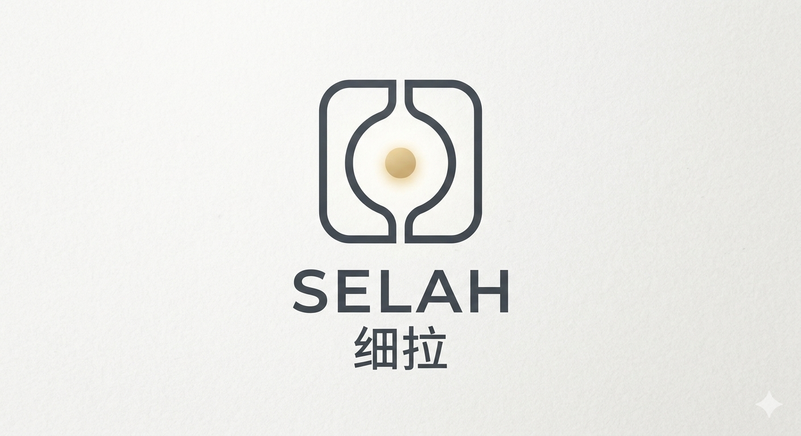

<p align="center">
   
</p>

# SELAH

This project is a personal AI assistant built using the Flutter framework. It provides a chat interface where users can interact with an AI model to receive responses to their queries.

## Features

- Chat interface for real-time communication with the AI.
- User-friendly design with chat bubbles for messages.
- Responsive layout that works on various screen sizes.
- Integration with an AI service to fetch responses.

## Project Structure

```
personal-ai-assistant
├── lib
│   ├── main.dart                # Entry point of the application
│   ├── screens
│   │   └── home_screen.dart     # Main screen with chat interface
│   ├── widgets
│   │   └── chat_bubble.dart      # Widget for displaying chat messages
│   ├── models
│   │   └── message.dart          # Model for chat messages
│   └── services
│       └── ai_service.dart       # Service for interacting with the AI model
├── pubspec.yaml                  # Project configuration and dependencies
├── test
│   └── widget_test.dart          # Widget tests for the application
└── README.md                     # Project documentation
```

## Getting Started

To run this project, ensure you have Flutter installed on your machine. Follow these steps:

1. Clone the repository:
    ```
    git clone <repository-url>
    ```

2. Navigate to the project directory:
    ```
    cd personal-ai-assistant
    ```

3. Install the dependencies:
    ```
    flutter pub get
    ```

4. Run the application:
    ```
    flutter run
    ```

## Contributing

Contributions are welcome! Please feel free to submit a pull request or open an issue for any suggestions or improvements.

## License

This project is licensed under the MIT License. See the LICENSE file for more details.